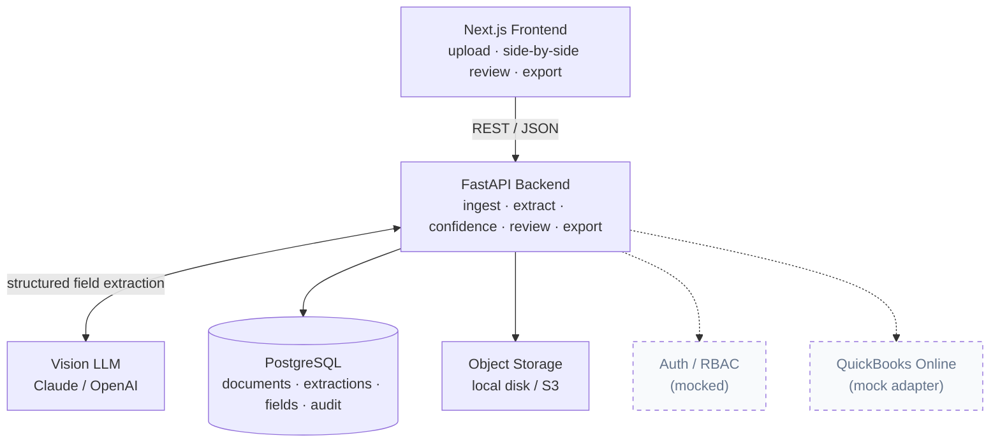

# LedgerLens — AI Accounting Document Processing

> Upload invoices, receipts, and statements → extract structured data with **field-level
> confidence** → review and correct **side-by-side** → approve → export clean transactions.

LedgerLens is a **reviewer-in-the-loop** pipeline that turns messy accounting documents into clean,
exportable data. A vision LLM does the extraction; the human only touches the fields that are
actually uncertain.

This public proof-of-concept is a **sanitized reconstruction** of a production accounting-automation
pipeline I built and operate for a real business — a system that cut its monthly bookkeeping from
roughly **80 hours to 4 hours**. The production system is private (it handles real financial data).
This repo rebuilds the core **extraction → confidence → human review → export** loop on the stack
clients most often ask for, so the approach can be inspected end to end.

> ⚠️ **Demo data only.** Every sample document in this repo is synthetic. No real client, company, or
> financial data is included anywhere.


---

## What it does

1. **Upload** a PDF or image (invoice, receipt, supplier bill).
2. **Extract** structured fields with a vision LLM: supplier, invoice number, date, VAT, total,
   currency, and line items.
3. **Score** every field — model self-assessment combined with deterministic validation checks.
4. **Review** side-by-side: original document on the left, editable fields on the right,
   low-confidence fields highlighted first.
5. **Approve** — corrections and approvals are written to an audit trail.
6. **Export** approved transactions to CSV / Excel.

**Design principle:** the goal is *not* 100% automatic. It is **minimum human time per document** —
the machine does the work, the human only touches what's uncertain.

---

## The interesting part — confidence as a combined signal

Confidence is **not** a single number from the model. It combines two independent signals:

**a. Model self-assessment** — the vision model returns a per-field confidence (0–1) as part of a
strict-JSON output (one object per field with `value` and `confidence`, plus a `line_items` array).

**b. Deterministic validation** — rule checks that don't depend on the model:

| Field            | Check                                          |
| ---------------- | ---------------------------------------------- |
| `date`           | parses to a real calendar date                 |
| `currency`       | valid ISO 4217 code                            |
| `vat` / `total`  | VAT consistent with total and expected rate    |
| `line_items`     | sum of line amounts ≈ subtotal                 |
| `invoice_number` | matches expected pattern (configurable regex)  |

**Final confidence** = `model_confidence × validation_penalty`, where a failed check caps the field
(e.g. ×0.5, hard-capped at 0.4). Fields below a configurable threshold (default `0.85`) are
`flagged` and surfaced first in the review UI. The threshold lives in config/env so it's tunable
without code changes.

This is what makes the loop fast: the reviewer's attention is spent only where both the model *and*
the rules are unsure.

---

## Screenshots

> _Screenshots and the demo GIF are captured from a local run; placeholders until added to `docs/`._

| Upload | Side-by-side review |
| ------ | ------------------- |
|  |  |

| Flagged low-confidence fields | CSV / Excel export |
| ----------------------------- | ------------------ |
|  |  |

---

## Architecture



The PoC implements the full extraction-and-review loop. Auth/RBAC and the QuickBooks Online
integration are **stubbed with mock adapters** — intentionally out of scope for a PoC, fully scoped
for production (see [Roadmap](#roadmap-to-production)).

---

## Tech stack

| Layer        | Choice                                  |
| ------------ | --------------------------------------- |
| Frontend     | Next.js (React, TypeScript)             |
| Backend      | FastAPI (Python)                        |
| Database     | PostgreSQL                              |
| Extraction   | Vision LLM — Claude / OpenAI            |
| File storage | Local disk (PoC) → S3-compatible (prod) |

Chosen to match the most common client request: Next.js + FastAPI + Postgres + OpenAI/Claude.

---

## Scope — implemented vs. stubbed

| Feature                                   | Status           |
| ----------------------------------------- | ---------------- |
| Single-doc upload (PDF / image)           | ✅ Implemented    |
| AI field extraction (structured output)   | ✅ Implemented    |
| Field-level confidence + validation       | ✅ Implemented    |
| Side-by-side review & edit                | ✅ Implemented    |
| Approve + audit trail                     | ✅ Implemented    |
| CSV / Excel export                        | ✅ Implemented    |
| Multi-tenant auth & role-based access     | 🔸 Mock          |
| QuickBooks Online sync (mapping, posting) | 🔸 Mock adapter  |
| Bulk upload                               | 🔸 Stub          |
| Bank-statement parsing                    | 🔸 Stub          |

---

## Data model

```
documents
  id, filename, mime_type, storage_path,
  status (uploaded|processing|extracted|reviewed|approved), created_at

extractions
  id, document_id (fk), model, raw_json, created_at

fields
  id, extraction_id (fk), key (supplier|invoice_number|date|vat|total|currency),
  value, model_confidence, validation_status (pass|fail|n/a),
  final_confidence, flagged (bool),
  corrected_value, corrected_by, corrected_at

line_items
  id, extraction_id (fk), description, qty, unit_price, amount, confidence

audit_log
  id, document_id (fk), action, actor, before_json, after_json, created_at
```

---

## API surface

```
POST   /documents                      upload file → returns document_id + fields, triggers extraction
GET    /documents                      list with status
GET    /documents/{id}                 status + extracted fields + confidence
GET    /documents/{id}/file            original document (for the side-by-side pane)
PATCH  /documents/{id}/fields/{fid}    correct a field value (writes audit_log)
POST   /documents/{id}/approve         mark approved (writes audit_log)
GET    /documents/{id}/export?format=csv|xlsx   download data
GET    /health                         provider + status

# stubbed (return mock responses)
POST   /auth/login                     mock auth
POST   /documents/{id}/sync/quickbooks mock QBO posting
```

Interactive OpenAPI docs are served at `http://localhost:8000/docs`.

---

## Repository layout

```
ledgerlens/
├── README.md
├── SPEC.md                  ← internal build spec
├── docker-compose.yml       ← optional postgres
├── backend/
│   ├── app/
│   │   ├── main.py          ← FastAPI app, CORS, init_db, routers
│   │   ├── models.py        ← SQLAlchemy models
│   │   ├── schemas.py       ← pydantic I/O
│   │   ├── api/             ← documents (core loop) + stubs (auth, QBO)
│   │   └── services/
│   │       ├── extraction/  ← provider abstraction: mock|claude|openai|google_vision
│   │       ├── validation.py    ← deterministic rule checks
│   │       ├── confidence.py     ← model × validation → final_confidence + flagged
│   │       ├── export.py         ← CSV / Excel
│   │       └── storage.py        ← local disk (S3-swappable interface)
│   ├── scripts/seed_samples.py   ← synthetic invoice generator
│   ├── samples/             ← generated synthetic invoices (PDF/PNG + sidecar)
│   ├── requirements.txt
│   └── .env.example
└── frontend/
    ├── app/
    │   ├── page.tsx               ← upload + document list
    │   └── review/[id]/page.tsx   ← side-by-side review (the showpiece)
    ├── lib/api.ts                 ← backend client
    └── .env.local.example
```

---

## Run locally

No infrastructure required — the backend defaults to **SQLite** and the **`mock`** extractor,
so the full loop runs offline with zero API keys.

```bash
# Backend
cd backend
python -m venv .venv && source .venv/bin/activate
pip install -r requirements.txt
cp .env.example .env                 # defaults: EXTRACTION_PROVIDER=mock, SQLite
python scripts/seed_samples.py       # generate synthetic invoices into backend/samples/
uvicorn app.main:app --reload        # creates tables on startup → http://localhost:8000

# Frontend (separate terminal)
cd frontend
cp .env.local.example .env.local
npm install
npm run dev                          # → http://localhost:3000
```

Open `http://localhost:3000`, upload a sample from `backend/samples/`, and walk the full loop:
upload → review the flagged low-confidence fields → correct → approve → export.

**Swapping the extractor.** Set `EXTRACTION_PROVIDER` in `backend/.env` to one of
`mock | claude | openai | google_vision` and provide the matching credential
(`ANTHROPIC_API_KEY`, `OPENAI_API_KEY`, or `GOOGLE_APPLICATION_CREDENTIALS`). Install the
provider's SDK from the optional block in `requirements.txt`. `google_vision` reproduces the
production family-business pipeline (Cloud Vision OCR + deterministic field parsing).

**Postgres (optional).** `docker compose up -d postgres`, then set `DATABASE_URL` in
`backend/.env` to the Postgres URL shown in `.env.example`.

---

## Roadmap to production

What turns this PoC into the SaaS in a typical brief (maps to a Phase-1 MVP):

- **Auth & tenancy** — real multi-tenant auth; admin / staff / client roles; row-level isolation.
- **QuickBooks Online** — OAuth; customer/supplier/chart-of-accounts mapping; transaction posting.
- **Throughput** — bulk upload; async processing queue; retry/backoff.
- **More document types** — bank statements; multi-page bills; multi-currency normalization.
- **Hardening** — observability; rate limiting; per-tenant usage metering; deployment & docs.

---

## About

Builder & consultant based in Japan. I run a production version of this pipeline for a real business
(private). Happy to do a live walkthrough of every line in this repo on a call.

📧 righteousness0414@gmail.com
