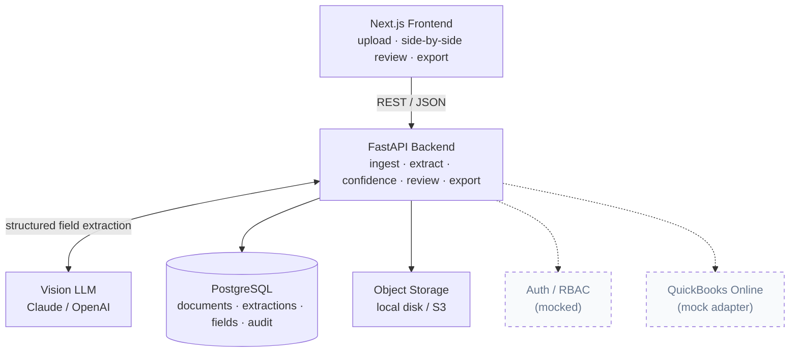

# LedgerLens — Internal Build Spec

> **Internal document.** The public-facing project description lives in [README.md](README.md).
> This file is the build specification: sections 4–10 fully specify what to build.

> Upload invoices, receipts, and statements → extract structured data with **field-level
> confidence** → review and correct **side-by-side** → approve → export clean transactions.

**This is a sanitized, simplified reconstruction of a production accounting-automation pipeline**
I built and operate for a real business, which cut monthly bookkeeping from **~80 hours to ~4 hours**.
The production system is private (it processes real financial data). This public proof-of-concept
rebuilds the core **extraction → confidence → human review → export** loop on the stack most clients
ask for, so the approach can be inspected end to end.

> ⚠️ **Demo data only.** All sample documents are synthetic. No real client, company, or financial
> data is included anywhere in this repo.

> 🔧 **This file is also the build spec.** Sections 4–10 fully specify what to build. Build the core
> loop first; leave stubs for last (see *Suggested build order*).

<!-- TODO: replace with a 10–15s demo GIF of the full upload → review → export loop -->


---

## 1. What it does

A reviewer-in-the-loop pipeline that turns messy accounting documents into clean, exportable data:

1. **Upload** a PDF or image (invoice, receipt, supplier bill).
2. **Extract** structured fields with a vision LLM: supplier, invoice number, date, VAT, total, currency, line items.
3. **Score** every field — model self-assessment combined with deterministic validation checks.
4. **Review** side-by-side: original document left, editable fields right, low-confidence fields highlighted.
5. **Approve** — corrections and approvals are written to an audit trail.
6. **Export** approved transactions to CSV / Excel.

Design principle: the goal is **not** 100% automatic. It is **minimum human time per document** —
the machine does the work, the human only touches what's uncertain.

---

## 2. Architecture



The PoC implements the full extraction-and-review loop. Auth/RBAC and the QuickBooks Online
integration are **stubbed with mock adapters** — out of scope for a PoC, fully scoped for production
(see *Roadmap*).

---

## 3. Tech stack

| Layer        | Choice                                  |
| ------------ | --------------------------------------- |
| Frontend     | Next.js (React, TypeScript)             |
| Backend      | FastAPI (Python)                        |
| Database     | PostgreSQL                              |
| Extraction   | Vision LLM — Claude / OpenAI            |
| File storage | Local disk (PoC) → S3-compatible (prod) |

Chosen to match the most common client request (Next.js + FastAPI + Postgres + OpenAI/Claude).

---

## 4. Build scope — built vs. stubbed

| Feature                                   | PoC status       |
| ----------------------------------------- | ---------------- |
| Single-doc upload (PDF / image)           | ✅ Build          |
| AI field extraction (structured output)   | ✅ Build          |
| Field-level confidence + validation       | ✅ Build          |
| Side-by-side review & edit                | ✅ Build          |
| Approve + audit trail                     | ✅ Build          |
| CSV / Excel export                        | ✅ Build          |
| Multi-tenant auth & role-based access     | 🔸 Mock          |
| QuickBooks Online sync (mapping, posting) | 🔸 Mock adapter  |
| Bulk upload                               | 🔸 Stub          |
| Bank-statement parsing                    | 🔸 Stub          |

---

## 5. Data model

```
documents
  id, filename, mime_type, storage_path,
  status (uploaded|processing|extracted|reviewed|approved),
  created_at

extractions
  id, document_id (fk), model, raw_json, created_at

fields
  id, extraction_id (fk), key (supplier|invoice_number|date|vat|total|currency),
  value, model_confidence, validation_status (pass|fail|n/a),
  final_confidence, flagged (bool),
  corrected_value, corrected_by, corrected_at

line_items
  id, extraction_id (fk), description, qty, unit_price, amount, confidence

audit_log
  id, document_id (fk), action, actor, before_json, after_json, created_at
```

---

## 6. API surface

```
POST   /documents                      upload file → returns document_id, triggers extraction
GET    /documents                      list with status
GET    /documents/{id}                 status + extracted fields + confidence
PATCH  /documents/{id}/fields/{fid}    correct a field value (writes audit_log)
POST   /documents/{id}/approve         mark approved (writes audit_log)
GET    /documents/{id}/export?format=csv|xlsx   download approved data

# stubbed (return mock responses)
POST   /auth/login                     mock auth
POST   /documents/{id}/sync/quickbooks mock QBO posting
```

---

## 7. Extraction & confidence logic *(the important part)*

Confidence is **not** a single number from the model. It combines two signals:

**a. Model self-assessment** — the vision model returns a per-field confidence (0–1) as part of its
structured JSON output. Prompt the model to return strict JSON only (no prose), one object per field
with `value` and `confidence`, plus a `line_items` array.

**b. Deterministic validation** — rule checks that don't depend on the model:

| Field          | Check                                            |
| -------------- | ------------------------------------------------ |
| date           | parses to a real calendar date                   |
| currency       | valid ISO 4217 code                              |
| vat / total    | VAT consistent with total and expected rate      |
| line_items     | sum of line amounts ≈ subtotal                   |
| invoice_number | matches expected pattern (configurable regex)    |

**Final confidence** = `model_confidence × validation_penalty`, where a failed check caps the field
(e.g. multiply by 0.5 / hard-cap at 0.4). Fields below a configurable threshold (e.g. `0.85`) are
`flagged = true` and surfaced first in the review UI.

Keep the threshold in config/env so it's tunable without code changes.

---

## 8. Frontend screens

1. **Upload** — drag-and-drop, shows processing status.
2. **Review (core view)** — split layout: rendered document on the left, editable field rows on the
   right. Flagged/low-confidence fields visually distinct (color + confidence badge). Inline edit.
3. **Approve** — confirm corrected data; disabled until required fields present.
4. **Export** — CSV / Excel download of approved data.

Key components: `UploadZone`, `ReviewSplit`, `FieldRow` (value + confidence badge + edit),
`LineItemsTable`, `ExportButton`.

---

## 9. Suggested project structure

```
ledgerlens/
├── README.md                ← this file
├── docker-compose.yml       ← postgres
├── samples/                 ← synthetic invoices (PDF/PNG)
├── docs/                    ← screenshots, demo.gif
├── backend/
│   ├── app/
│   │   ├── main.py
│   │   ├── api/             ← route handlers
│   │   ├── services/        ← extraction, confidence, validation, export
│   │   ├── models/          ← SQLAlchemy models
│   │   └── schemas/         ← pydantic
│   ├── requirements.txt
│   └── .env.example
└── frontend/
    ├── app/ (or pages/)
    ├── components/          ← UploadZone, ReviewSplit, FieldRow, ...
    ├── package.json
    └── .env.example
```

---

## 10. Suggested build order

1. DB + models + docker-compose (Postgres up).
2. `POST /documents` upload + object storage + status.
3. Extraction service → Vision LLM → strict-JSON parse → persist `extractions` + `fields`.
4. Confidence + validation engine → `final_confidence` + `flagged`.
5. `GET /documents/{id}` + frontend **ReviewSplit** (the showpiece).
6. `PATCH` field correction + audit_log.
7. Approve + CSV/Excel export.
8. Mock auth + mock QuickBooks adapter (last).
9. Seed `samples/`, capture screenshots + demo gif into `docs/`.

---

## 11. Run locally

```bash
# Database
docker compose up -d postgres

# Backend
cd backend
cp .env.example .env          # add LLM API key, DB url, confidence threshold
pip install -r requirements.txt
uvicorn app.main:app --reload

# Frontend
cd frontend
cp .env.example .env.local
npm install
npm run dev
```

Open `http://localhost:3000`, upload a sample from `samples/`, walk the loop.

---

## 12. Roadmap to production

What turns this PoC into the SaaS in a typical brief (maps to a Phase-1 MVP):

- **Auth & tenancy** — real multi-tenant auth; admin / staff / client roles; row-level isolation.
- **QuickBooks Online** — OAuth; customer/supplier/chart-of-accounts mapping; transaction posting.
- **Throughput** — bulk upload; async processing queue; retry/backoff.
- **More document types** — bank statements; multi-page bills; multi-currency normalization.
- **Hardening** — observability; rate limiting; per-tenant usage metering; deployment & docs.

---

## Screenshots to capture *(for the published README)*

- `docs/01-upload.png` — drag-and-drop upload + status
- `docs/02-review.png` — **side-by-side review** (the one that sells it)
- `docs/03-confidence.png` — flagged low-confidence fields
- `docs/04-export.png` — CSV/Excel export
- `docs/demo.gif` — full loop, 10–15s

---

## About

Builder & consultant based in Japan. I run a production version of this pipeline for a real
business (private). Happy to do a live walkthrough of every line in this repo on a call.

📧 righteousness0414@gmail.com